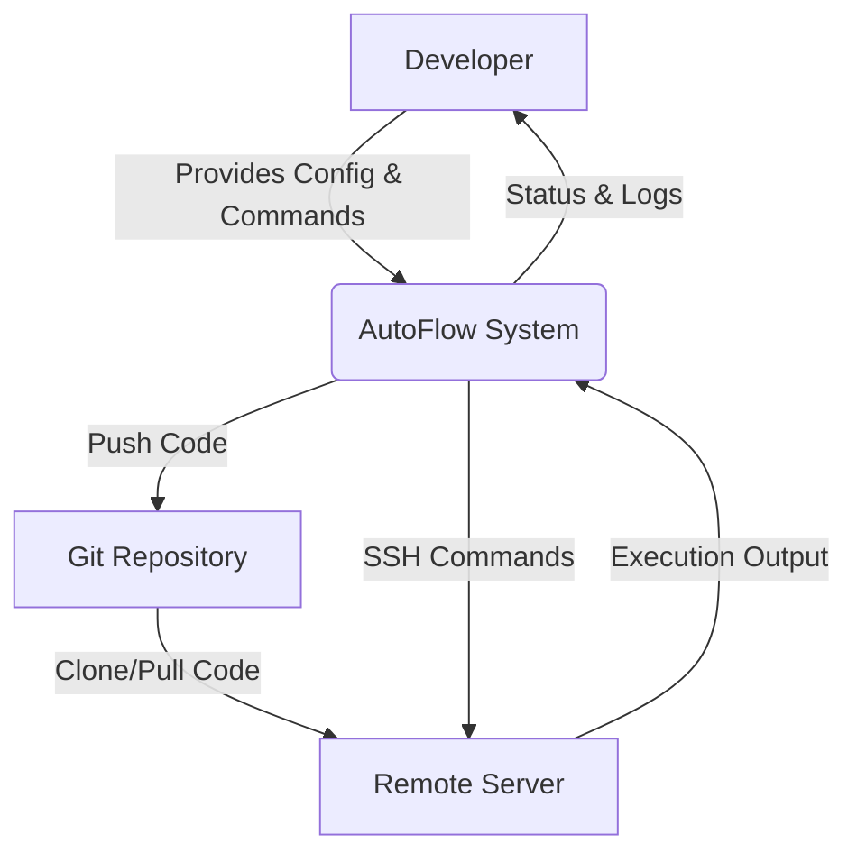

# Context Level Data Flow Diagram (DFD)

```mermaid
graph TD
    User[Developer] -->|Provides Config & Commands| System(AutoFlow System)
    System -->|Status & Logs| User
    
    System -->|Push Code| GitRepo[Git Repository]
    GitRepo -->|Clone/Pull Code| RemoteServer[Remote Server]
    
    System -->|SSH Commands| RemoteServer
    RemoteServer -->|Execution Output| System
```
