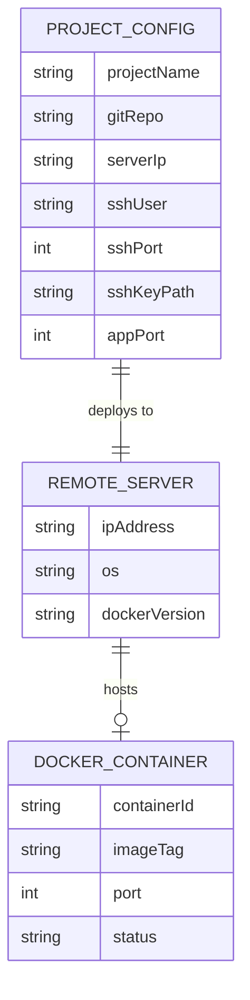

# Entity Relationship Diagram (ERD)

Since AutoFlow is a CLI tool, the "entities" are logical configuration objects and external systems it interacts with.

```mermaid
erDiagram
    PROJECT_CONFIG {
        string projectName
        string gitRepo
        string serverIp
        string sshUser
        int sshPort
        string sshKeyPath
        int appPort
    }

    REMOTE_SERVER {
        string ipAddress
        string os
        string dockerVersion
    }

    DOCKER_CONTAINER {
        string containerId
        string imageTag
        int port
        string status
    }

    PROJECT_CONFIG ||--|| REMOTE_SERVER : "deploys to"
    REMOTE_SERVER ||--o| DOCKER_CONTAINER : "hosts"
```
