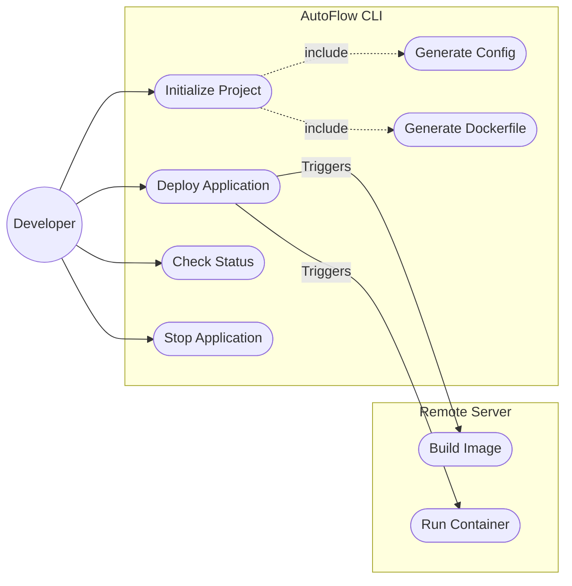

# Use Case Diagram

```mermaid
graph LR
    %% Actor
    Developer((Developer))

    %% System Boundary: AutoFlow CLI
    subgraph "AutoFlow CLI"
        UC1(["Initialize Project"])
        UC2(["Deploy Application"])
        UC3(["Check Status"])
        UC4(["Stop Application"])
        UC5(["Generate Config"])
        UC6(["Generate Dockerfile"])
    end

    %% System Boundary: Remote Server
    subgraph "Remote Server"
        UC7(["Build Image"])
        UC8(["Run Container"])
    end

    %% Relationships
    Developer --> UC1
    Developer --> UC2
    Developer --> UC3
    Developer --> UC4

    %% Includes
    UC1 -.->|"include"| UC5
    UC1 -.->|"include"| UC6
    
    %% Triggers
    UC2 -->|"Triggers"| UC7
    UC2 -->|"Triggers"| UC8
```
