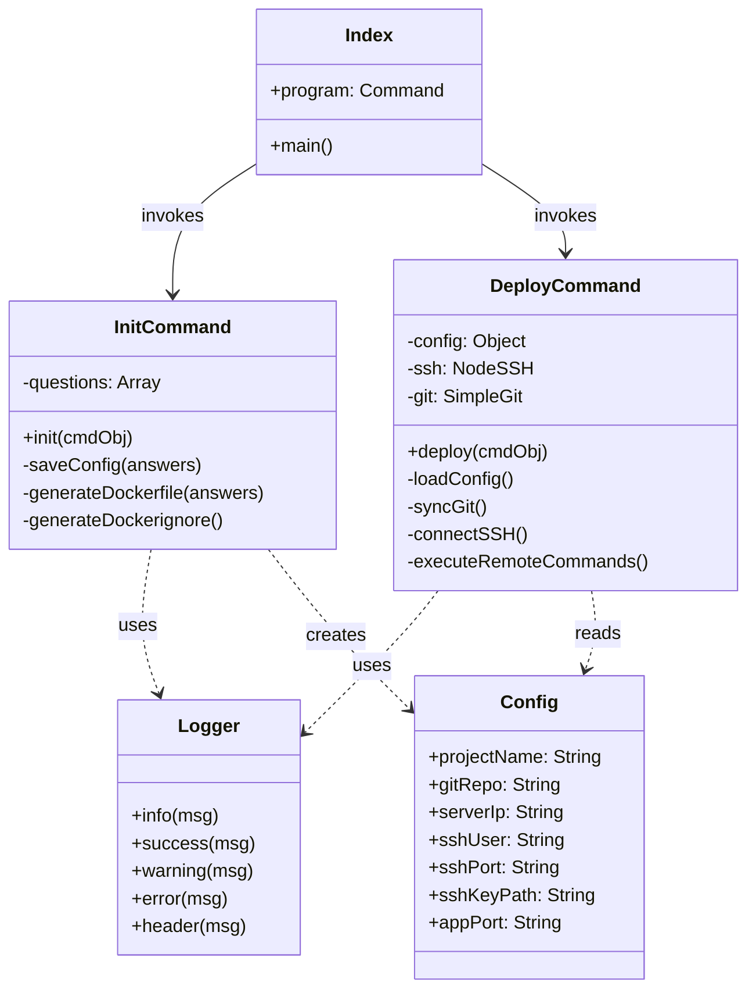

# Class Diagram

Note: Since the codebase is written in functional JavaScript, this diagram represents the logical classes and modules.

```mermaid
classDiagram
    class Index {
        +program: Command
        +main()
    }

    class InitCommand {
        -questions: Array
        +init(cmdObj)
        -saveConfig(answers)
        -generateDockerfile(answers)
        -generateDockerignore()
    }

    class DeployCommand {
        -config: Object
        -ssh: NodeSSH
        -git: SimpleGit
        +deploy(cmdObj)
        -loadConfig()
        -syncGit()
        -connectSSH()
        -executeRemoteCommands()
    }

    class Logger {
        +info(msg)
        +success(msg)
        +warning(msg)
        +error(msg)
        +header(msg)
    }

    class Config {
        +projectName: String
        +gitRepo: String
        +serverIp: String
        +sshUser: String
        +sshPort: String
        +sshKeyPath: String
        +appPort: String
    }

    Index --> InitCommand : invokes
    Index --> DeployCommand : invokes
    InitCommand ..> Logger : uses
    DeployCommand ..> Logger : uses
    DeployCommand ..> Config : reads
    InitCommand ..> Config : creates
```
