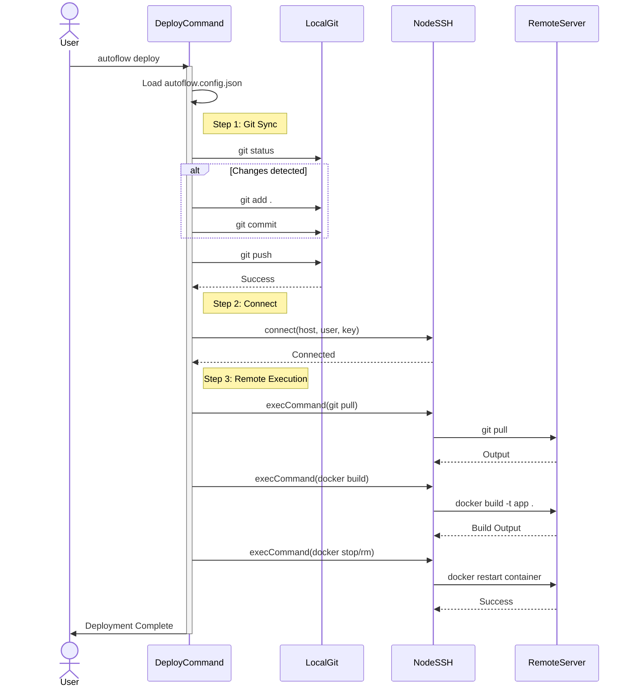

# Interaction Diagram (Sequence Diagram)

Focusing on the `deploy` command execution.

```mermaid
sequenceDiagram
    actor User
    participant CLI as DeployCommand
    participant Git as LocalGit
    participant SSH as NodeSSH
    participant Server as RemoteServer

    User->>CLI: autoflow deploy
    activate CLI
    
    CLI->>CLI: Load autoflow.config.json
    
    note right of CLI: Step 1: Git Sync
    CLI->>Git: git status
    alt Changes detected
        CLI->>Git: git add .
        CLI->>Git: git commit
    end
    CLI->>Git: git push
    Git-->>CLI: Success

    note right of CLI: Step 2: Connect
    CLI->>SSH: connect(host, user, key)
    SSH-->>CLI: Connected

    note right of CLI: Step 3: Remote Execution
    CLI->>SSH: execCommand(git pull)
    SSH->>Server: git pull
    Server-->>SSH: Output
    
    CLI->>SSH: execCommand(docker build)
    SSH->>Server: docker build -t app .
    Server-->>SSH: Build Output
    
    CLI->>SSH: execCommand(docker stop/rm)
    SSH->>Server: docker restart container
    Server-->>SSH: Success

    CLI->>User: Deployment Complete
    deactivate CLI
```
