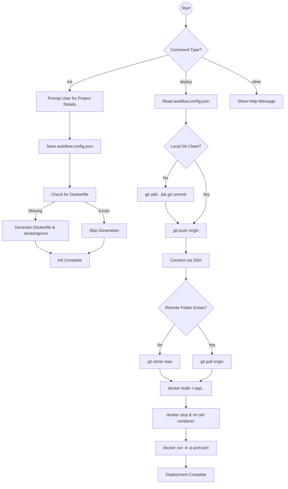

# System Flow Diagram

```mermaid
graph TD
    Start((Start)) --> CommandCheck{Command Type?}
    
    %% INIT FLOW
    CommandCheck -- init --> AskQuestions[Prompt User for Project Details]
    AskQuestions --> SaveConfig[Save autoflow.config.json]
    SaveConfig --> CheckDocker[Check for Dockerfile]
    
    CheckDocker -- Missing --> GenDocker[Generate Dockerfile & .dockerignore]
    CheckDocker -- Exists --> SkipDocker[Skip Generation]
    
    GenDocker --> SuccessInit[Init Complete]
    SkipDocker --> SuccessInit
    
    %% DEPLOY FLOW
    CommandCheck -- deploy --> ReadConfig[Read autoflow.config.json]
    ReadConfig --> GitClean{Local Git Clean?}
    
    GitClean -- No --> AutoCommit[git add . && git commit]
    AutoCommit --> GitPush[git push origin]
    GitClean -- Yes --> GitPush
    
    GitPush --> SSHConnect[Connect via SSH]
    SSHConnect --> RemoteExists{Remote Folder Exists?}
    
    RemoteExists -- No --> GitClone[git clone repo]
    RemoteExists -- Yes --> GitPull[git pull origin]
    
    GitClone --> DockerBuild[docker build -t app .]
    GitPull --> DockerBuild
    
    DockerBuild --> DockerClean[docker stop & rm old container]
    DockerClean --> DockerRun[docker run -d -p port:port]
    
    DockerRun --> SuccessDeploy[Deployment Complete]
    
    %% OTHER
    CommandCheck -- other --> ShowHelp[Show Help Message]
```
